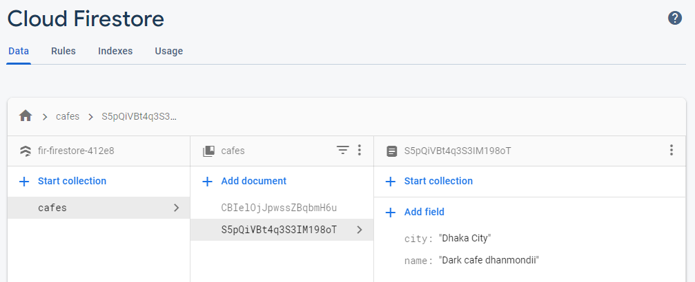

In this section we're gonna talk about Firebase for Web. let's dive into it.

- [What is Firebase?](#what-is-firebase)
- [Database](#database)
    - [Advantage of firebase database](#advantage-of-firebase-database)
    - [Database Types](#database-types)
  - [Firestore](#firestore)

## What is Firebase?

Will update soon.

## Database

Cloud Firestore is a NoSQL document database that lets you easily store, sync, and query data for your mobile and web apps - at global scale.

#### Advantage of firebase database

1. Real time syncing for data.
2. Collaboration across devices with ease.
3. Build serverless apps.
4. Optimized for offline use.
5. Strong user-based security.

#### Database Types

1. Realtime Database
2. Cloud Firestore

In here, we will talk about Firestore only.

### Firestore

**Step 1** : Create a project in the Firebase

**Step 2** : Create database in the firestore. This is noSQL database.

**Step 3** : Add firebase connect script in your local project.

```html
<!-- In the head -->
<script src="https://www.gstatic.com/firebasejs/8.0.2/firebase-app.js"></script>
<script src="https://www.gstatic.com/firebasejs/8.0.2/firebase-firestore.js"></script>
```

```HTML
// At the end of body tag
<script>
    var firebaseConfig = {
      apiKey: "xxxxxxxxxxxxxxxxxxxxxxxxxxxxx",
      authDomain: "fir-firestore-412e8.firebaseapp.com",
      databaseURL: "https://fir-firestore-412e8.firebaseio.com",
      projectId: "xxxxxxxxxxxxxxxx",
      storageBucket: "fir-firestore-412e8.appspot.com",
      messagingSenderId: "215924766926",
      appId: "xxxxxxxxxxxxxxxxxxxxxxxxxxxx",
    };
    firebase.initializeApp(firebaseConfig);
    const db = firebase.firestore();
    db.settings({ timestampsInSnapshorts: true });
  </script>
```

**Step 4** : How to Insert/fetch/delete/update data

This is the picture of my sample database


<br/><br/>

**1. Fetching data**

```Javascript
db.collection("cafes").where("city", "==", "Dhaka").orderBy("name").get()
  .then((snapshot) => {
    snapshot.docs.forEach((doc) => {
      console.log(doc);
    });
  });

// The following way is for realtime
db.collection("cafes").orderBy("city").onSnapshot((snapshot) => {
  let changes = snapshot.docChanges();
  changes.forEach((change) => {
    if (change.type === "added") {
      console.log(change.doc);
      // display data into dom
    } else if (change.type === "removed") {
      console.log(change.doc.id);
      // remove data from dom
    }
  });
});
```

**2. Saving data**
```Javascript
  db.collection("cafes").add({
    name: "Dark cafe dhanmondi",
    city: "Dhaka City",
  });
```

**3. Updating data**

```Javascript
  // id = the collection we want to update
  db.collection("cafes").doc(id).update({
    name: "Dark cafe dhanmondi",
    city: "Dhaka City",
  });

// There is another method called set which override the rest of the property. we can use set/update depends on situation.
```

**4. Delete data**
```Javascript
  // id = the collection we want to delete
  db.collection("cafes").doc(id).delete();
```
